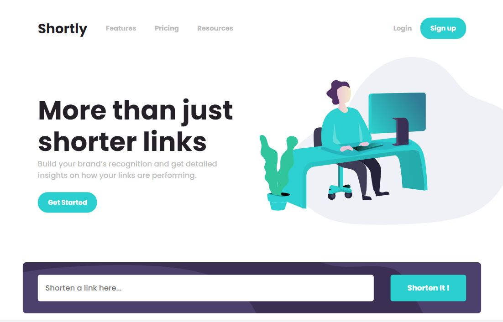

# URL shortening API page

This is a solution to the [URL shortening API Challenge on Frontend Mentor](https://www.frontendmentor.io/challenges/url-shortening-api-landing-page-2ce3ob-G). This landing page  integrates with the [shrtcode API](https://app.shrtco.de/), which is used to shorten any valid URL through a simple query. It's open-source and it's completely free.

## Table of contents

- [Overview](#overview)
  - [Screenshot](#screenshot)
  - [Links](#links)
- [Process](#process)
  - [Built with](#built-with)
  - [Useful resources](#useful-resources) 
- [Author](#author)

## Overview

Users should be able to:

- View the optimal layout for the site depending on their device's screen size
- Shorten any valid URL
- See a list of their shortened links, even after refreshing the browser
- Copy the shortened link to their clipboard in a single click
- Receive an error message when the `form` is submitted if:
  - The `input` field is empty
  - URL is invalid

### Screenshot

Desktop and mobile version of URL Shortening Page.

### Links

- Live Site URL: [URL Shortening Page](https://jelenkoo10.github.io/url_shortening_api/)

## Process

### Built with

- Semantic HTML5 markup
- CSS variables
- Flexbox
- Asynchronous JavaScript
- Regular expressions
- localStorage
- Mobile-first workflow

### Useful resources

- [Adding ::after horizontal lines](https://unclebigbay.com/how-to-add-horizontal-lines-before-and-after-a-text-in-html) - This helped me add cyan horizontal lines after cards in Info section. I really like this concept and I will use it going forward.
- [Getting current width of the screen](https://www.w3schools.com/howto/howto_js_get_current_window.asp) - This helped me get my current screen width I needed for manipulation of links' length.

## Author

- GitHub - [https://github.com/jelenkoo10](https://github.com/jelenkoo10)
- Frontend Mentor - [@jelenkoo10](https://www.frontendmentor.io/profile/jelenkoo10)
